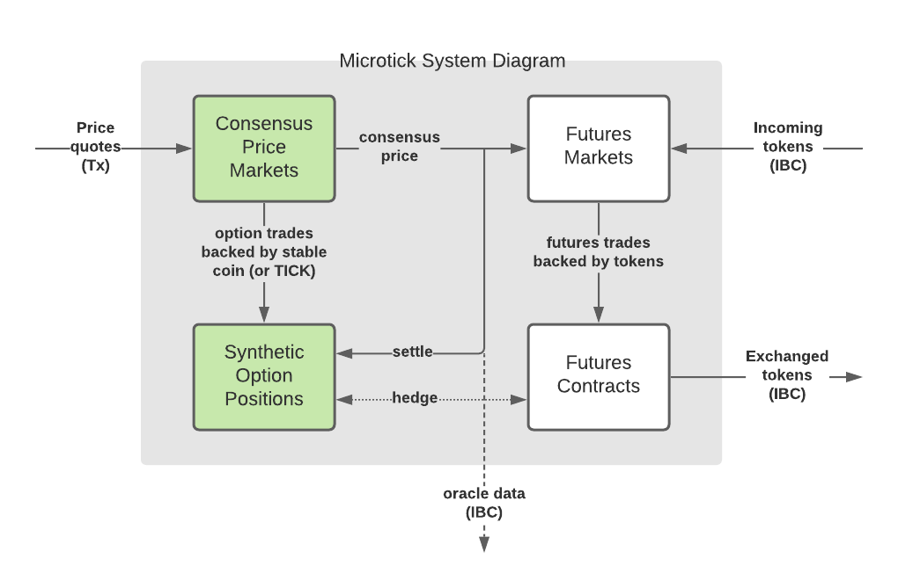
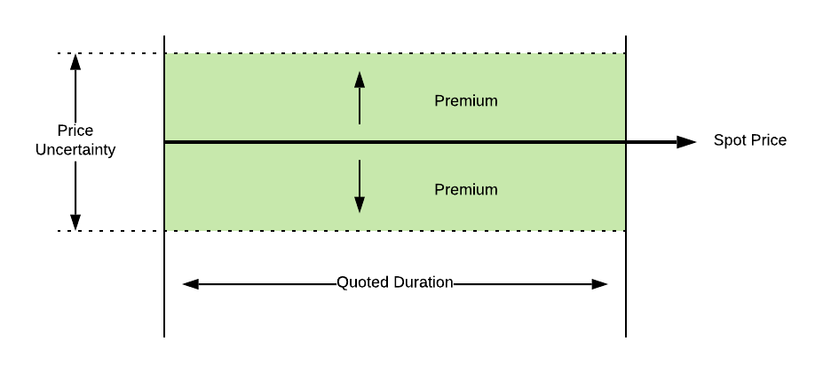
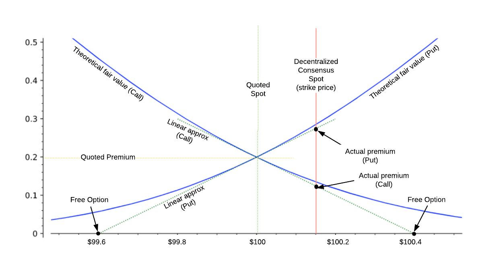

As discussed in the last section, Microtick's consensus markets are the result of engineering a Schelling point consensus mechanism for price discovery using option pricing as the reward / slashing mechanism. The result, which is not only better suited as a fair and real-time reward incentive, is an oracle consensus price that promotes price competition for its hedging mechanism through trading.

In this section we'll take a look how the price consensus markets work in Microtick (shown in green in the diagram below).

### Benefits to the Cosmos ecosystem

There are other oracles available in Cosmos but Microtick offers one that is both stable (i.e. does not depend on volatility for its price discovery) and one that can be hedged. If your Dapp depends on data but there's no way to hedge exposure with your current oracle, or worse, intra-block volatility can cause significant losses, you might benefit from using Microtick's hedgeable consensus price markets. Even better, they do not depend on tokenization of the underlying asset in order to reap the benefits of decentralized price discovery.

## Market Mechanics

### The Basics

#### Price quotes

Microtick uses a native token as backing for price quotes places on its consensus markets. These price quotes are weighted and averaged together to arrive at a consensus price. The weights are based on how tight the market maker is willing to specify the +/- accuracy for their quote over the time duration of the market as well as on the amount of backing the market maker is willing to put behind the price quote.
 
The diagram below illustrates a quote. The **Spot Price** is the current price the market maker is quoting on the market, used as the data point value in the consensus weighted average. The quote's premium depends on the time duration - the longer the time duration the quote is meant to cover, the more the price uncertainty, and hence more premium for the quote to cover that uncertainty.

For more information on what is meant by "premium" see the [FAQ](faq.md).

#### Trades

#### Markets

A Microtick market consists of a set of standardized time durations:

* 5-minute 
* 15-minute
* 1-hour
* 4-hour
* 12-hour

Each standardized time duration has a separate order book of quotes.  Market makers compete for best premium in both directions (calls and puts) on each of the standardized time durations.  Lower premiums get filled first for trade market orders.  However, the lower the premium the more risk to the market maker of the price moving further than the premium amount over the duration of the trade.

Therefore, the market makers play a game of placing and maintining quotes with accurate real world spot and volatility estimates (while tracking the Microtick consensus to ensure consistency).  Traders play a game of looking for trading opportunities based on underpriced premiums or a consensus price that differs significantly from the real-world value.

### Deep Dive

#### Quotes

A quote consists of the following elements:

| Name             | Description                                    | Set by                 |
|------------------|------------------------------------------------|------------------------|
| Spot             | Assertion of a real-world spot price           | Market Maker           |
| Token Backing    | Market maker backs the quote with an amount of on-chain token value. |  Market Maker        |
| Premium | A fair value for both a put and a call with a strike price = the quote’s spot price. | Market Maker |
| Duration | Standardized duration |  Market Maker |
| Weight (Quantity) | Weight, also referred to as quantity, is calculated by the following formula: Weight =Token BackingLeverage * Premium  Leverage is a constant set to 10 for all quotes currently. | Game rules |
| Actual Call Premium |  Dynamic value | |
| Actual Put Premium | Dynamic value | |

Call Price= Premium +Spot - Consensus2
Game rules, may vary block by block

Put Price = Premium - Spot - Consensus2
Game rules, may vary block by block

A quote is an assertion of real-world price made by the market maker and backed with an amount on on-chain token backing.

The premium is an ask price for either a call or put, assuming a strike price equal to the quoted spot price.  This is the amount a trader would pay to the market maker for either a call or a put, if the quote were the only quote on a particular market.  However, most of the time there is more than one quote on a market.  The Microtick marketplace dynamically adjusts the quoted ask price based on its proximity to the consensus price and the direction of a trade (more on this later, just remember that ask premium is used as the basis but adjusted according to market and trading conditions.

Ask premium depends on time duration because volatility goes up with time duration.  As such, the premium for 5-minute quotes is going to be much less than for 12-hour quotes.

The actual call and put premiums paid by traders to the market maker in practice depends on how far the quoted spot lies from the global consensus price at the time of the trade.  This is based on a linear approximation to the theoretical values for an option as the strike price moves away from the spot price, as shown in the following figure.  Note that the delta (slope of the linear approximation) is always close to +/- ½ for an at-the-money short-term option, which is what allows us to make the approximation.  The linear approximation is always less than theoretical fair value for points away from the quoted spot, which further incentivizes quotes to be kept accurate.

When placing a quote, the following “2x limitations” apply:

Spot 2x limitation.  A quote cannot be placed that will become a free call or put on the resulting order book. This rule protects the party placing the quote as well as limits the spot to be within 2x of the quoted premium of the resultant consensus.  This rule also lets us calculate the maximum amount a given amount of tokens can move the price of a market:
Max consensus change =2 * New Quote's Token BackingLeverage * Active Quote Weights
This formula applies for any spot within 2x of the premium according to the above rule, regardless of the spot, premium or time duration chosen by the market maker.

Premium 2x limitation.  A quote cannot be placed with a premium of more than 2x the current order book consensus premium for that time duration.  The order book consensus premium is defined as:
Order Book Consensus Premium =order book quotesBackingLeverage * order book quotesWeight 
for the order book the quote is placed on. This rule means a quote must be competitive on the order book and can’t be placed with an arbitrarily large premium.

Time 2x limitation.  A quote must be updated within 2x the time duration or anyone may cancel it and collect the backing for the quote.  This ensures stagnant quotes will always be removed from the marketplace.

Normally, for reasonable market makers placing earnest quotes the above limitations will never be an issue.

#### Trades

A trade consists of the following elements:

Name
Description
Set by
Direction
Call (long) or Put (short)
Trader
Strike Price
Threshold value above (call) or below (put) which the trader is “in-the-money”
Game rules set the strike price as the current market consensus price when a trade is placed.
Expiration Time
Trade expiration after which it may be settled.
Game rules set the expiration time as the current time plus the duration for the order book the trade is placed on.
Quantity
Quantity is another word for weight when specifying an amount for the trade.
Trader
Token Backing
Tokens are transferred from the quote into the trade according to the proportion of trade quantity to quote quantity when the trade is filled.
Game rules transfer quote backing to become trade backing when a trade is matched.
Current Value
For a call, if the current consensus price is higher than the strike price:

Call =Quantity *(Consensus - Strike)

For a put, if the current consensus price is lower than the strike price:

Put =Quantity *(Strike - Consensus)
Game rules, may vary block by block until settled

A trade is purchased from the market maker according to the quantity multiplied by the actual call or put value of the quote at the time the trade is placed.  (See “Actual Call Premium” and “Actual Put Premium” descriptions under the Quotes section)

Once expiration time has passed, a trade may be settled by anyone sending a Settle transaction to the chain.  There is a small commission paid to the account that sends the Tx, which acts as an incentive.

The trader that bought the call or put is paid the current value of the trade at the time of settlement.  This amount is taken out of the trade backing (if the amount is more than the trade backing, the extra value is ignored).  Finally, the original market maker is reimbursed the unpaid backing back into their original account.

Trades may have more than one quote as counter parties.  In this case, each individual counterparty is handled using the same rules as described above.
Global Consensus
All active quotes are weighted as described under Quotes, above.
At all times, the weighted average of the spot prices of all active quotes across all standardized time durations is defined to be the global consensus price for a market.

Global Consensus =quotes (Spot * Weight)quotes Weight

To place a trade, traders specify a direction and a quantity (weight) on a given order book.  Placing a trade removes that amount of quantity (weight) from the quote and the consensus is recalculated.
