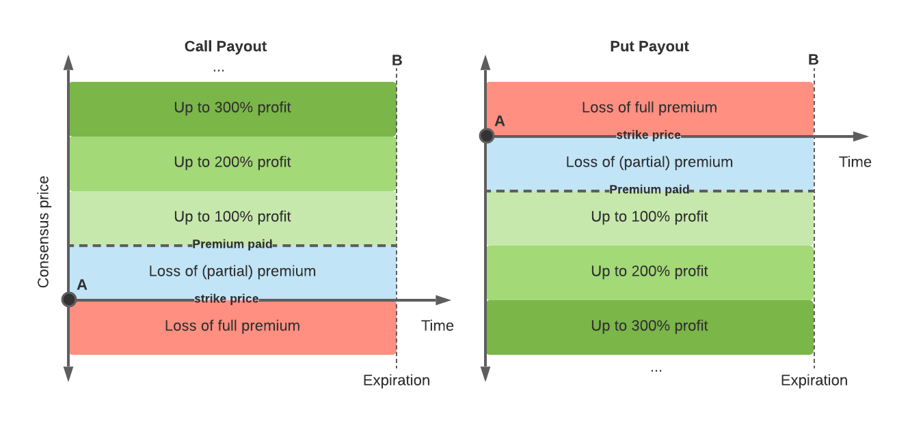

### Is Microtick an oracle?

"Yes, and not exactly."

Yes, Microtick is an oracle in that a stable consensus price is generated on-chain by averaging prices similar to the way a typical oracle pool might work. This consensus can be used by other Dapps and blockchains on Cosmos or any chain that can connect to IBC.

But Microtick is also a standalone marketplace that generates a consensus price that can be traded, hedged and arbitraged (in the case of tokenized assets) using a futures mechanism [Futures](futures.md).

### Can the futures price be different from the live price on an AMM or DEX?

Yes! Because the Microtick consensus is based on an average of prices, some of which have durations of up to 12 hours, there is no reason for those market makers to rapidly update their quotes. This can cause the price to lag (or lead, depending on if prices are mean reverting) the live trading price on a DEX or AMM. If the Microtick price is better than the live price and you can wait for the futures delivery, go for it!

For more information see the section on [Price Discovery](overview.md)

### What is meant by premium and how much can I make trading Microtick options?

Premium is a term used for the price paid by the buyer of an option for owning the price movement in that direction. Payouts in Microtick are based on multiples of the premium paid as shown in the diagram below:

In the diagram, point **A** represents the point at which all Microtick options start (time=0, with the consensus at the strike price). The premium paid is represented by the height of the blue box in the diagrams. The profit of a long option position is in relationship to where the consensus price ends up with respect to the strike price and the premium paid at the expiration time **B** of the option.

For calls, if the consensus price ends up greater than the strike price (the consensus price moves up over the life of the option), the payout for positive price movement is in multiples of the premium paid as shown on the left of the diagram.

For puts, if the consensus price ends up less than the strike price (the consensus price moves down over the life of the option), the payout for negative price movement is in multiples of the premium paid as shown on the right of the diagram.

If the consensus moves in the opposite direction (down for calls, or up for puts), the entire premium is lost, regardless of how far the consensus price moves.

