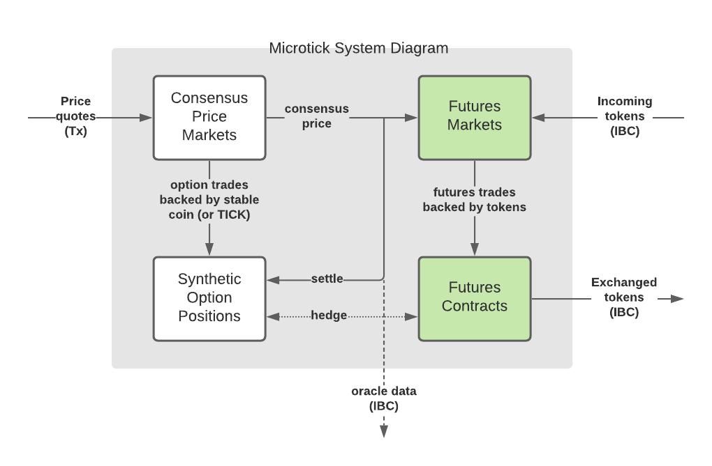
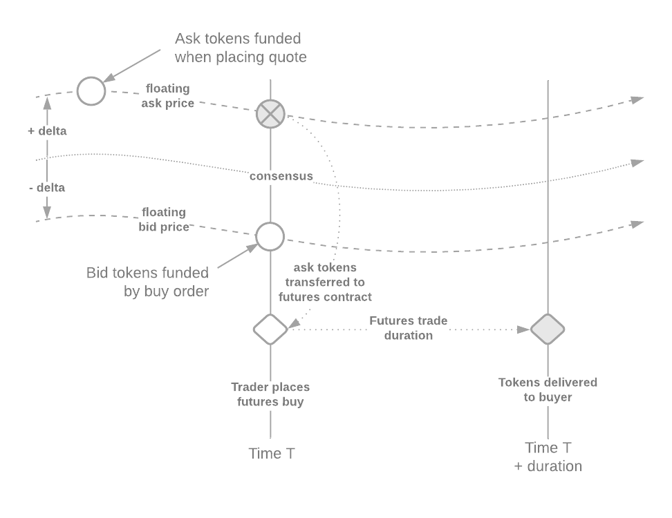

_This feature is being proposed and not yet under development._

Futures and options are similar products and can work together to bring the Microtick consensus price to tradable reality (for  tokenized assets only). For non-tokenized assets, similar futures markets could be built off-chain for other types of assets, or built into escrow arrangements to settle OTC trades.

In this section we will focus on the Microtick token futures markets and futures contracts (shown in green below).

### Benefits to the Cosmos ecosystem

What this means to the Cosmos ecosystem is an additional pool of liquidity available for trading IBC tokens. As will be shown below, tokens of the same denomination but originating from different chains will be able to take advantage of the same Microtick consensus price even though these are different token types. This is because on the Microtick system price discovery is decoupled from trade activity.

## Token Futures 

The primary goal of the design of the Microtick token futures markets was to create the capability to trade tokenized assets **on-chain and at the consensus price** as determined by the separate and distinct, option-based consensus price markets (shown in white above).

A core requirement of the futures product is the ability to create riskless hedge using the options traded on the existing Microtick consensus markets, such that the consensus markets and futures markets are counterparts, one backed by native tokens using options, the other backed with off-chain IBC tokens using futures. In order to do this, the futures contracts will be standardized using the same method (time durations) as the consensus markets use:

| Asset   | Backing         | Standardization                                     |
|---------|:---------------:|-----------------------------------------------------|
| Options | Native token    | Time duration (5-minute, 15-minute, 1-hour, etc)    |
| Futures | IBC Token       | Time duration (5-minute, 15-minute, 1-hour, etc)    |

A side benefit of this design, possible because price discovery is decoupled from trading, is gained when trading IBC assets of the same denomination but originating from different chains. The Microtick system can trade these assets using the exact same liquidity pools for price discovery, while keeping the token exchange markets distinct and possibly with a different spread that reflects varying degrees of risk for assets transferred through multiple chains. As such, there should be less need to unwind IBC tokens through multiple chains when trading using Microtick.

### Buying a token future (taker)

**Buying a token future** means the taker pays the **denominator** asset immediately to the maker in return for the future delivery of the numerator asset at contract expiration. The ratio of numerator asset to denominator asset is computed from one or more feeder consensus markets.

#### Example

BTC/ETH is priced at 20 on a Microtick consensus market and a maker has placed a futures quote based on this consensus feed. A buyer wants to buy 2.5 12-hour BTC/ETH futures (disregarding any quote delta prices) so they pay 2.5 * 20 = 50 ETH to the maker immediately. After 12 hours, the buyer can claim 2.5 BTC from the smart contract.

### Selling a token future (taker)

**Selling a token future** means the taker pays the **numerator** asset immediately to the maker in return for the future delivery of the denominator asset at contract expiration. The ratio of numerator asset to denominator asset is computed from one or more feeder consensus markets.

#### Example

Using the same price as the last example, a seller wants to sell 1.5 12-hour BTC/ETH futures. Upon selling the contract, they pay 1.5 BTC to the maker immediately. After 12 hours, the seller can claim 1.5 * 20 = 30 ETH from the smart contract.

### Placing a token futures quote (maker)

The maker places a balanced quote on the futures market by depositing IBC tokens into the quote and specifying the consensus price(s) to use for reference, and +/- delta spread. 

For the maker there is no further interaction required until the quote is either canceled or the maker wishes to change the spread.

## Market Mechanics

Futures markets on Microtick will use a floating order book, specified through a single +/- delta price that specifies the spread for each quote placed on the order book.  As the consensus price (or price ratio) generated on the consensus markets moves up and down the absolute values of the bids and asks for the floating order book move automatically, keeping the same relationship to the consensus price as specified by the delta price in the quote.

The same thing happens in reverse for a futures sell order:

Because the Microtick futures quotes float with the consensus price, they can simply stay open until canceled. The tokens paid by the taker get automatically added to the opposing side of the quoted spread so the maker doesn't have to do anything to continue to accrue profit from trading activity.  (In real-world use the maker will likely be monitoring the consensus price market in relation to external markets such as DEX's and AMM's)

## Stablecoin Base Markets

Because the Microtick consensus price is an exact floating point number, there is no need to operate a distinct price market for ETH/BTC as long as there is a ETH/DAI and BTC/DAI market running. The consensus price for ETH/BTC is a simple calculation - the ratio of ETH/DAI divided by BTC/DAI. Reducing the number of consensus price markets concentrates liquidity by reducing the number of markets from N * (N-1) / 2 to just N.

## Hedging Token Futures with Consensus Price Options

Here are a couple more examples showing how futures trades, based on the consensus price and backed by tokens, can be directly hedged using the options backed by native tokens. In both examples the ratio of numerator : denominator asset is determined by the external consensus price (or ratio of consensus prices as described in the preceding section) plus or minus the bid or ask delta, at the time the trade is undertaken.

#### Example 1

As an example, to understand how this works, assume a consensus price market where the token pair is a target
asset (BTC in the example) in units of the native token backing (DAI stablecoin on the Microtick main chain). 
Currently the USD price of BTC is around $30K so we'll use that for this example.

Suppose a buyer buys quantity 0.25 12-hour BTC/DAI futures with the consensus price at 30100 BTC/DAI and an ask delta 
of +50. This means the effective rate is 30150 (consensus + ask delta). The buyer pays 0.25 * 30150 = 7537.5 DAI to the
seller immediately.

Because the native token is also DAI, this position can be directly hedged with a 12-hour synthetic short position 
(long 0.25 put / short 0.25 call) on the consensus price market. Suppose the synthetic position costs 12.5 DAI and 
has a strike price of 30100.

With these two positions, no matter where the consensus price ends up (higher or lower than at the start), the buyer
ends up paying the spread of 25 DAI as a worst case scenario (1/4 the ask delta of +50 and the synthetic cost of 12.5).
This is because the buyer can always sell the same amount of BTC/DAI futures back at the new consensus price.
Best case, the buyer can move the tokens off-chain and sell them for a better price elsewhere.

Position cost: 7537.5 DAI + 12.5 DAI = 7550 DAI

| Ending consensus price | 0.25 BTC value    | Put payout | Call liability | Net profit (loss) |
|------------------------|-------------------|------------|----------------|-------------------|
| 32000                  | 8000 DAI          | 0          | (475)          | -25 DAI           |
| 29000                  | 7250 DAI          | 275        | 0              | -25 DAI           |

This example illustrates how the futures market will allow traders to take advantage of the consensus price with
actual token backing.

#### Example 2

Let's take a more complicated example where the futures contract uses BTC/ETH but the Microtick options 
stillpay in native token backing (DAI). We'll see that this only requires a second synthetic position, the first 
on the BTC/DAI consensus market and the second on the ETH/DAI consensus market.

For simplicity and example's sake let's assume there is no futures spread and the synthetic positions cost a net 0 DAI.

Assume this time the buyer is buying 0.25 BTC/ETH futures.  The Microtick consensus prices are 30100 BTC/DAI 
and 875 ETH/DAI. This means the consensus BTC/ETH ratio is 34.4. Therefore, 0.25 BTC/ETH futures cost 8.6 ETH, paid to
the futures contract seller immediately.

The buyer can now hedge with a synthetic short position on BTC/DAI (long 0.25 put / short 0.25 call) and a synthetic long position on ETH/DAI (long 8.6 call / short 8.6 put).

At expiration, the net value of the position is zero, worst case. If the buyer can sell his BTC off-chain for more, then the position becomes profitable.

| Ending BTC | Ending ETH | 0.25 BTC | 8.6 ETH | BTC Put | BTC Call | ETH Call | ETH Put | Net profit (loss) |
|------------|------------|----------|---------|---------|----------|----------|---------|-------------------|
| 32000      | 950        | 8000     | (8170)  | 0       | (475)    | 645      | 0       | 0                 |
| 29000      | 950        | 7250     | (8170)  | 275     | 0        | 645      | 0       | 0                 |
| 32000      | 750        | 8000     | (6450)  | 0       | (475)    | 0        | (1075)  | 0                 |
| 29000      | 750        | 7250     | (6450)  | 275     | 0        | 0        | (1075)  | 0                 |

