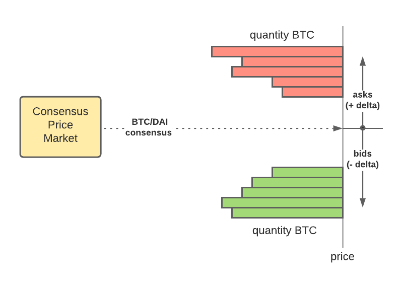

_This feature is being proposed and not yet under development._

Futures and options are similar product and in the Microtick case can work together to
enable short-term token futures that bring the Microtick consensus price to tradable reality (for 
tokenized assets only). In the future, it is easy to imagine similar futures markets being built
off-chain for other types of assets, or even built into escrow arrangements to settle OTC trades.

| Asset   | Backing         | Standardization                                     |
|---------|:---------------:|-----------------------------------------------------|
| Futures | Token deposit   | Time duration (5-minute, 15-minute, 1-hour, etc)    |
| Options | Native token    | Time duration (5-minute, 15-minute, 1-hour, etc)    |

## Operation

Futures as proposed would be standardized by time duration in a manner identical to the Microtick short-term
option product. This allows the two asset classes to be used as a hedge against one another.

In addition, they would be traded using a floating order book, specified by +/- delta prices from the
underlying consensus price. This would allow Microtick token futures and synthetic option positions to be used
as a direct hedge against each other.

**Buying a token future** means the buyer pays the denomination asset immediately to the seller in return for
the future delivery of the numerator asset at contract expiration.

**Selling a token future** means the seller receives the denomination asset immediately and deposits backing 
to the contract to cover the future delivery at contract expiration.

In both cases, the ratio of numerator : denominator asset is determined by the external consensus price, plus or 
minus the bid or ask delta, at the time the trade is undertaken.

## Example 1

As an example, to understand how this works, assume a consensus price market where the token pair is a target
asset (BTC in the example) in units of the native token backing (DAI stablecoin on the Microtick main chain). 
Currently the USD price of BTC is around $30K so we'll use that for this example.

Suppose a buyer buys quantity 0.25 12-hour BTC/DAI futures with the consensus price at 30100 BTC/DAI and an ask delta 
of +50. This means the effective rate is 30150 (consensus + ask delta). The buyer pays 0.25 * 30150 = 7537.5 DAI to the
seller immediately.

Because the native token is also DAI, this position can be directly hedged with a 12-hour synthetic short position 
(long 0.25 put / short 0.25 call) on the consensus price market. Suppose the synthetic position costs 12.5 DAI and 
has a strike price of 30100.

With these two positions, no matter where the consensus price ends up (higher or lower than at the start), the buyer
ends up paying the spread of 25 DAI as a worst case scenario (1/4 the ask delta of +50 and the synthetic cost of 12.5).
This is because the buyer can always sell the same amount of BTC/DAI futures back at the new consensus price.
Best case, the buyer can move the tokens off-chain and sell them for a better price elsewhere.

Position cost: 7537.5 DAI + 12.5 DAI = 7550 DAI

| Ending consensus price | 0.25 BTC value    | Put payout | Call liability | Net profit (loss) |
|------------------------|-------------------|------------|----------------|-------------------|
| 32000                  | 8000 DAI          | 0          | (475)          | -25 DAI           |
| 29000                  | 7250 DAI          | 275        | 0              | -25 DAI           |

This example illustrates how the futures market will allow traders to take advantage of the consensus price with
actual token backing.

## Example 2

Let's take a more complicated example where the futures contract uses BTC/ETH but the Microtick options 
stillpay in native token backing (DAI). We'll see that this only requires a second synthetic position, the first 
on the BTC/DAI consensus market and the second on the ETH/DAI consensus market.

For simplicity and example's sake let's assume there is no futures spread and the synthetic positions cost a net 0 DAI.

Assume this time the buyer is buying 0.25 BTC/ETH futures.  The Microtick consensus prices are 30100 BTC/DAI 
and 875 ETH/DAI. This means the consensus BTC/ETH ratio is 34.4. Therefore, 0.25 BTC/ETH futures cost 8.6 ETH, paid to
the futures contract seller immediately.

The buyer can now hedge with a synthetic short position on BTC/DAI (long 0.25 put / short 0.25 call) and a synthetic long position on ETH/DAI (long 8.6 call / short 8.6 put).

At expiration, the net value of the position is zero, worst case. If the buyer can sell his BTC off-chain for more, then the position becomes profitable.

| Ending BTC | Ending ETH | 0.25 BTC | 8.6 ETH | BTC Put | BTC Call | ETH Call | ETH Put | Net profit (loss) |
|------------|------------|----------|---------|---------|----------|----------|---------|-------------------|
| 32000      | 950        | 8000     | (8170)  | 0       | (475)    | 645      | 0       | 0                 |
| 29000      | 950        | 7250     | (8170)  | 275     | 0        | 645      | 0       | 0                 |
| 32000      | 750        | 8000     | (6450)  | 0       | (475)    | 0        | (1075)  | 0                 |
| 29000      | 750        | 7250     | (6450)  | 275     | 0        | 0        | (1075)  | 0                 |

