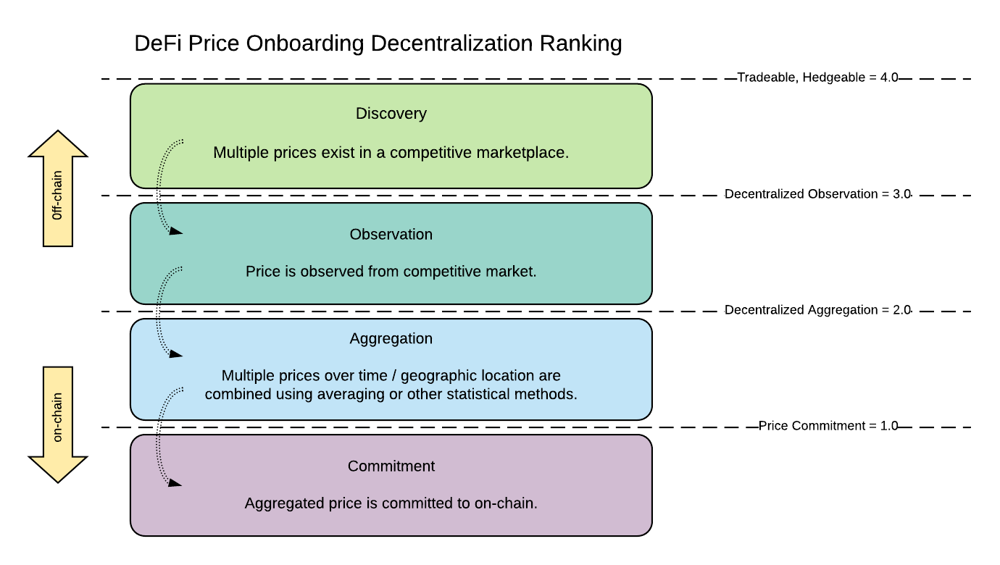

The following metric can be used as a basis for ranking various blockchain-based oracles. The diagram illustrates the stages of price discovery for any oracle. The more of those stages that happen on-chain, the higher the DeFi ranking for an oracle should be.
 

## Standard approach to oracles

The standard approach blockchains take for oracles is to enlist observers to input prices
to the chain over a specified time interval or "epoch". These price inputs are collected
and there is a calculation using statistical math to obtain a mean / median as well as
a confidence interval for the epoch.

(Image)

The observers who submitted the price values that lie above or below the confidence interval 
are then penalized, either financially through slashing or using an indirect reputation 
based mechanism.

The obvious problem with this method of collecting price inputs is prices can change, 
(sometimes dramatically) over the course of an epoch and by penalizing outliers these 
types of oracles can discourage observers from submitting a price at a new high or low
even if this is actually the correct observation.

## Option pricing applied to the oracle problem

Microtick takes a different approach to indentivizing accurate price inputs. Rather than
dividing time into fixed epochs, Microtick creates a set of markets of fixed time _duration_. 
The average of price inputs is calculated block by block, resulting in a consensus
price that updates in realtime with every change or new price input.

* Smart contract based.  Does not require tokenization.

* Similar to decentralized oracle pools, uses Schelling points and averages of price assertions. Does not use epochs, slashing or reputation.  Instead, we standardize assertions across fixed time durations to create trading opportunities using option pricing to adjust quotes in realtime (block by block).

* Cosmos SDK based, but could run on many types of chains.  Very easy to combine liquidity cross-chain.

* Similar to AMMs, the market price from the on-chain smart contract can double as a price oracle for other Dapps.

