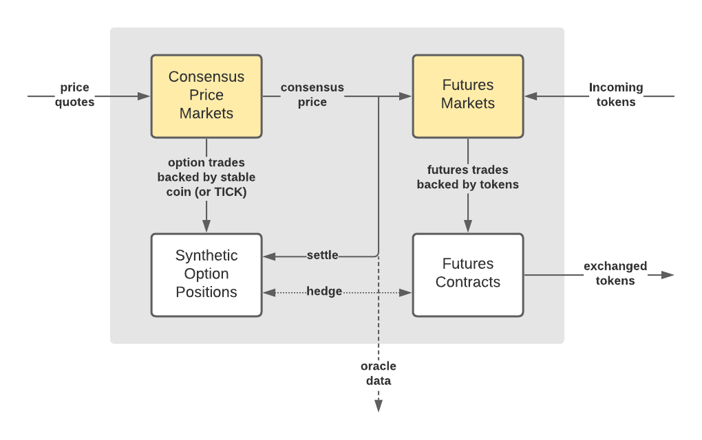

The Microtick project is a new mechanism for decentralized price discovery and trading. Its vision is to create a trading system more suited for blockchain usage where blocks come at discrete, relatively infrequent and sometimes unpredictable times, and then build upon that vision to create a new trading paradigm that not only works better on, but **promotes** decentralized trading over the legacy centralized paradigm.

Microtick has three distinguishing features that differ from trading platforms you've seen before:

* **Decoupled price discovery** in separate, self-contained Schelling point consensus price markets.
* A **short-term micro-option product** used to hedge consensus price volatility using the native on-chain backing token.
* **Token futures** used to trade tokenized assets using decoupled consensus prices, backed by tokens transferred on-chain through the Cosmos IBC protocol.

### Rethinking Price Discovery

To create such a trading system, we've borrowed a concept from game theory called the **Shelling point** and adapted it for trading using a well-known financial derivative: the option. Options are well suited as a blockchain oracle reward / slashing mechanism because the mathematics are well-known and the incentive structure is proven. For example, if a traditional oracle slashes participants for being outliers during a sampling window, then no one will want to be the first to put in new prices as they change. Options solve this by assigning a **time duration** to each quote and an accuracy range to manage stale quotes.

### Promoting Decentralization

The need to be as close to trading activity in order to observe and act upon the latest price as quickly as possible is a strong force towards centralization in today's financial markets. With this in mind, Microtick's goal is to decouple price discovery from the actual trading of an asset and to  leverage decentralized blockchain technology to promote a more stable Shelling point consensus
price - as an alternative to the latest observed trade price in typically volatile markets.

