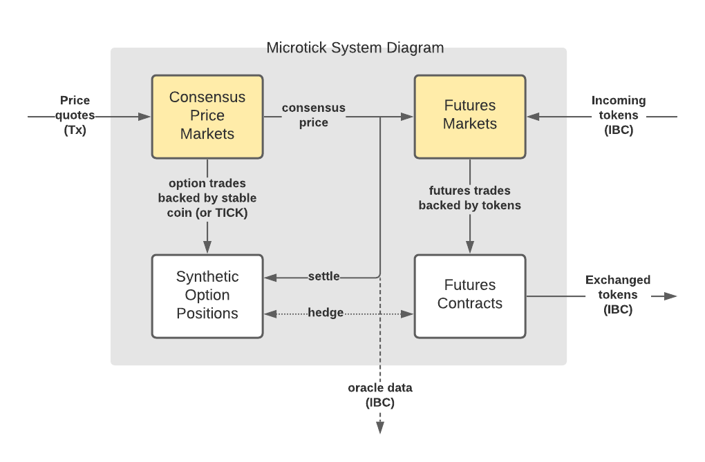

Microtick has three distinguishing features that differ from trading platforms you've seen before:

1. **Decoupled price discovery** in separate, self-contained Schelling point consensus price markets.
2. A **short-term micro-option product** used to hedge consensus price volatility using the native on-chain backing token.
3. **Token futures** used to trade off-chain tokenized assets based on the decoupled consensus prices, backed by tokens transferred on-chain through the Cosmos IBC protocol.

In traditional financial markets the term price discovery means passively observing prices that result from trading activity. The conventional order book can be viewed as a centralized price consensus mechanism that depends on the concentration of order flow into a single matching engine, to ensure trades execute at the best bid or ask. The accuracy of prices generated from an order book is dependent on the volume of trading activity and as such is highly sensitive to short term imbalances in supply and demand. As an example, during a price runup or selloff **the best bid or ask on an order book does not necessarily reflect an accurate consensus price**, hence the tendency for order books to mean revert after the short-term supply / demand imbalance corrects.

Order books have been adapted to decentralized blockchain technology by moving the matching engine into an on-chain smart contract but it doesn't always work as intended, with issues like front running still being possible at the miner or validator level and price spreads staying large due to uncertainty from block times and price discrepancies, information latency and order flow imbalances from different geographic areas.

Automated market makers improve on the order book as a decentralized trading mechanism by adding market maker functionality into the on-chain logic, substituting a bonding curve to approximate a natural supply / demand pricing curve. The result is a **trading engine** well adapted to blockchain technology but as a **price consensus mechanism** it is still highly sensitive to short term imbalances in supply and demand, just like the order book is. In fact, the AMM relies almost entirely on short-term price volatility for its price discovery since there are no fixed bids or asks like on an order book.

The Microtick project creates a stable mechanism for price discovery that does not rely on order flow or short-term price volatility to reach consensus. It does this using a Schelling point mechanism similar in spirit to blockchain oracle pools but with a consensus price that dynamically adjusts block by block in realtime, and one that can be hedged financially. Because the resulting consensus price is an average, it will tend to be more stable than an order book or automated market maker. In addition, it will tend to create an accurate, convergent consensus price even on assets that are not actively traded.

Trading tokenized assets is a coming feature under development that will allow traders to take advantage of the more stable Microtick consensus price using token futures contracts backed by assets transferred on-chain over the Cosmos IBC protocol. The result will be a liquidity pool available to the Cosmos ecosystem that can potentially bring more stability into markets through volatility pricing competition on the consensus price markets, combined with token arbitrage on the futures markets. In addition, Microtick will also be able to trade tokens of the same denomination but that originate from different source chains **using the same consensus price liquidity** (IBC treats these as separate assets and they would be separate and distinct pools of liquidity on an AMM or order book).

## 2021 Roadmap

Phase 1: **Complete**
* Decentralized main net
* Consensus price markets
* DAI stable coin backing

Phase 2: **In progress, likely Q1 2021**
* Interchain token transfers
* Additional price markets
* Option bids
* Synthetic positions
* Oracle price data over IBC

Phase 3: **Anticipated second half, 2021**
* Token futures with floating order book
* Cross-chain consensus price markets

## How Microtick works

Among the first questions people have when they encounter Microtick are:

* "How does it work?"
* "Is it an oracle?"
* "Can I trade real assets?"

The Microtick project is an experiment in a new mechanism for decentralized price discovery.

The term, "price discovery", is a very broad term. When used in the realm of traditional
financial markets, the term is used to refer to the passive act of observing prices trades occur at.
There are two assumptions behind this:

1. There is enough trade liquidity for an accurate price to be generated.
2. The price is observed in realtime. For example, 15-minute delated prices are probably no
longer accurate in a volatile market.

The need to be as close to trading activity in order to observe and act upon the latest price as quickly as
possible is a strong force towards centralization in today's financial markets. With this in mind,
Microtick's goal is to decouple price discovery from the actual trading of an asset and to 
leverage decentralized blockchain technology to promote a more stable Shelling point consensus
price - as an alternative to the latest observed trade price in typically volatile markets.

## Is Microtick an oracle?

"Yes, and not exactly."

Yes, Microtick is an oracle in that a stable consensus price is generated 
on-chain by averaging prices similar to the way a typical oracle pool might work. This consensus 
can be used by other Dapps and blockchains on Cosmos or any chain that can connect to IBC.

But Microtick is also a stand 
alone marketplace that generates a consensus price that can be traded, hedged and arbitraged (in the case of tokenized assets) using a futures mechanism (see "Futures").

## Can I trade real assets?

Yes, once the roadmap is complete Microtick will include an on-chain token futures capability that
will allow traders to transfer assets to the chain, trade them with futures contracts based on the 
Microtick consensus price, and hedge those futures contracts with options from the consensus 
price markets, as well as with arbitrage against other pools
of liquidity like off-chain DEX's and automated market makers.

